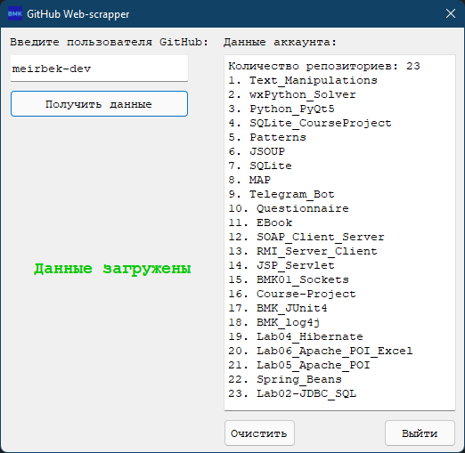
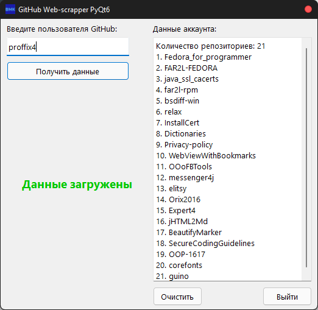
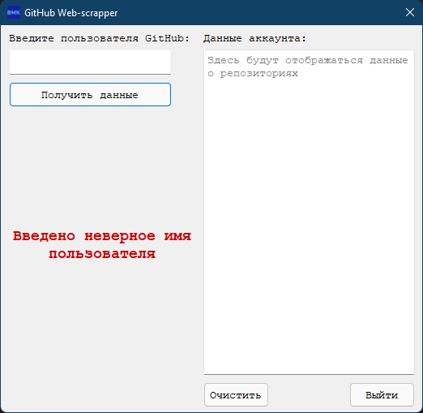

# BMK01_GitHub-Scrapper

## Современное кроссплатформенное программирование

### Курсовой проект. GitHub-scrapper PyQt6

### Необходимые библиотеки

```
pip3 install beautifulsoup4
pip3 install requests
```

### Вариант №1

Парсер данных с web-сайта GitHub на Python PyQt6.

## Программа

  


## Ошибка

